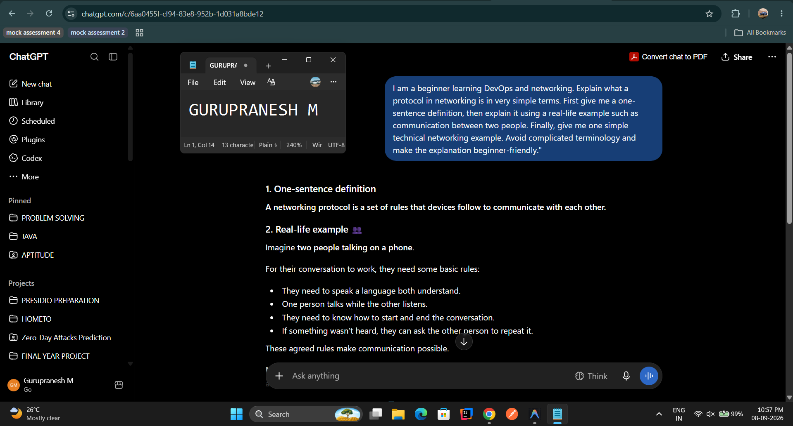
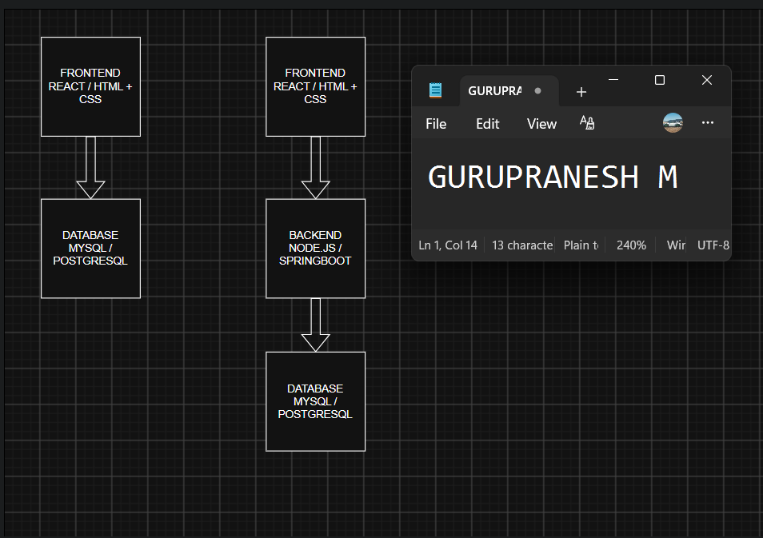
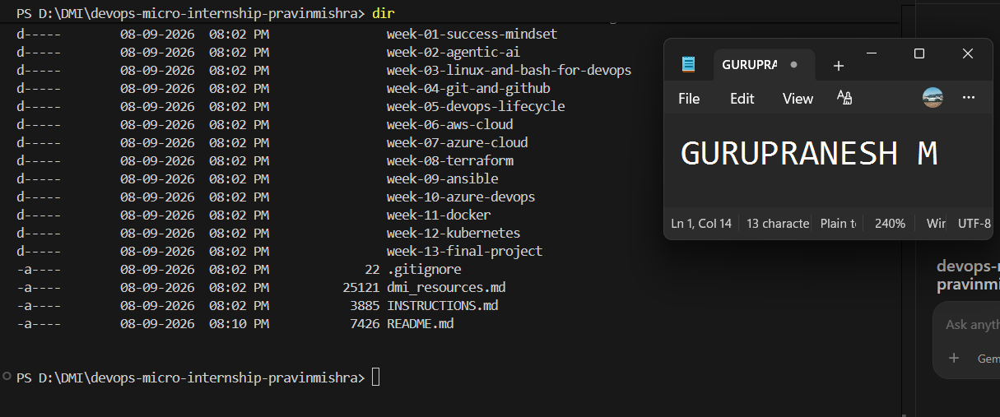

# Week 00 - Internet and Networking

Part of the DevOps Micro Internship (DMI) Cohort 3 with Agentic AI

---

# 🧑‍💻 Task 1: Using ChatGPT as Your Learning Assistant

## Scenario

You're new to DevOps and will frequently encounter technical questions. ChatGPT can be your learning companion.

## Your Task

Write a clear ChatGPT prompt to help you understand:

> "What is a protocol in networking? Explain with a simple real-life example."

Take a screenshot of your interaction showing:

* Your detailed prompt (with clear expectations)
* ChatGPT's simplified response with an example

## Screenshot

Save your screenshot in the `screenshots` folder and update the file name below.




Replace `task-1-chatgpt.png` with your actual screenshot file name.

---

## What I Learned (2–3 lines)

I learned that a networking protocol is a set of rules that devices follow to communicate with each other. The real-life examples helped me understand how protocols make communication organized and understandable between different devices.
---

# 🌐 Task 2: Internet and Networking

## Scenario

Your friend is launching an online bookstore named **EpicReads**.

He asked you to explain how users globally can access his website hosted in Finland.

## Your Task

Write a short explanation (**100–150 words**) that includes:

* Packet Switching
* IP Address
* TCP/IP
* HTTP/HTTPS

💡 **Tip:** You may use ChatGPT (as demonstrated in Task 1) to refine your explanation.

## Answer

When a user opens the EpicReads website from anywhere in the world, the request is divided into small units of data called packets. These packets travel through different networks using packet switching, where each packet can take an efficient route to reach the destination. The EpicReads server has an IP address that uniquely identifies it on the Internet. TCP/IP provides the basic rules for delivering these packets reliably between the user's device and the server. TCP handles reliable delivery while IP is responsible for addressing and routing packets. When the user accesses EpicReads, the browser communicates with the server using HTTP or HTTPS. HTTPS is preferred because it encrypts the communication, protecting sensitive information such as login credentials and payment details. Finally, the server sends the requested webpage back to the user's device.
---

# 🏗️ Task 3: Application Architecture & Stack

## Scenario

EpicReads bookstore has two application versions:

### Two-Tier Application

* Frontend
* Database

### Three-Tier Application

* Frontend
* Backend
* Database

## Your Task

* Draw simple diagrams (hand-drawn or tool-based such as draw.io)
* Label each layer clearly
* List at least two common technologies or tools used for each layer
* Submit a screenshot or photo clearly showing your own drawing

## Diagram Screenshot / Photo

Save your diagram image in the `screenshots` folder and update the file name below.




Replace `task-3-diagram.png` with your actual diagram file name.

---

## Technologies Used

### Frontend

* React
* Angular

### Backend

* Spring Boot
* Node.js / Express

### Database

* MySQL
* PostgreSQL

---

# 🌍 Task 4: Domain Name & DNS (Basic Concepts)

## Scenario

Your friend's bookstore **EpicReads** is currently accessible through:

```text
52.172.142.222:3000
```

He purchased the domain:

```text
epicreads.com
```

## Your Task

In **50–100 words**, explain in your own words:

1. What is DNS (Domain Name System)?
2. Which DNS record type should be used to connect the domain to the given IP, and why?

## Answer

DNS (Domain Name System) is like the Internet's phonebook. It converts human-readable domain names such as epicreads.com into IP addresses that computers use to locate servers. Since the EpicReads server is available at 52.172.142.222, an A record should be used to connect epicreads.com to this IPv4 address. When a user enters epicreads.com in a browser, DNS looks up the A record and returns the server's IP address, allowing the browser to connect to the correct server.

---

# 💻 Task 5: Visual Studio Code Setup (Hands-on)

## Your Task

Install Visual Studio Code (if not already installed).

Take a screenshot of your VS Code environment showing:

* Terminal open inside VS Code
* Running a basic command:

### Windows

```powershell
dir
```

### Linux / macOS

```bash
pwd
ls
```

* Your selected VS Code theme clearly visible

⚠️ **Important:** The screenshot must show your username or another identifiable detail to confirm it is your environment.

## Screenshot

Save your screenshot in the `screenshots` folder and update the file name below.




Replace `task-5-vscode.png` with your actual screenshot file name.

---

# 🔗 Task 6: Publish Your Assignment as a LinkedIn Post

## Objective

Publishing on LinkedIn helps you:

* Build your professional online presence
* Reinforce your learning
* Document your DevOps journey publicly

## Your Task

Summarize your answers from Tasks 1–5 into a LinkedIn post.

Clearly structure your post into the following sections:

* ChatGPT
* Internet & Networking
* App Architecture
* DNS
* VS Code Setup

Use the credit note that matches your track:

Add the following credit note at the end of your post **(If you are DMI Cohort 3 student)**:

> **P.S. This post is part of the DevOps Micro Internship (DMI) with Agentic AI — Cohort 3 — by Pravin Mishra. My graded progress is public: https://dmi.pravinmishra.com/s/YOUR-GITHUB-USERNAME.html · Start your DevOps journey: https://dmi.pravinmishra.com/?utm_source=student&utm_medium=ps-linkedin&utm_campaign=cohort3**


Add the following credit note at the end of your post **(If you are DMI Self-paced track student)**:

> **P.S. This post is part of the DevOps Micro Internship (DMI) — Self-Paced Engineer Track — by Pravin Mishra. My graded progress is public: https://dmi.pravinmishra.com/s/YOUR-GITHUB-USERNAME.html · Start your DevOps journey: https://dmi.pravinmishra.com/?utm_source=student&utm_medium=ps-linkedin&utm_campaign=self-paced**

Add the following credit note at the end of your post **(If you are DMI Campus student)**:

> **P.S. This post is part of the DevOps Micro Internship (DMI) — Campus — by Pravin Mishra. My graded progress is public: https://dmi.pravinmishra.com/s/YOUR-GITHUB-USERNAME.html · Start your DevOps journey: https://dmi.pravinmishra.com/?utm_source=student&utm_medium=ps-linkedin&utm_campaign=campus**

Replace `YOUR-GITHUB-USERNAME` with your GitHub username — that link is your public DMI progress page (your graded badge page).
---

## LinkedIn Post URL

Paste your LinkedIn post URL here:

```text
https://www.linkedin.com/posts/gurupranesh-m-14441b293_devops-networking-cloudcomputing-share-7503450974204710914-St62/?utm_source=share&utm_medium=member_desktop&rcm=ACoAAEcTPAQBP13HHWUcK0Ep-VK5LY6Dqo2Jpo4
```

---

## LinkedIn Post Backup Copy

Paste the full text of your LinkedIn post here:

Week 00 — Starting My DevOps Journey!

I have completed Week 00 of the DevOps Micro Internship (DMI) Cohort 3 with Agentic AI, focusing on the fundamentals of Internet and Networking.

ChatGPT
I learned how networking protocols act as a set of rules that allow devices to communicate with each other. Using real-life examples made the concept easier to understand.

Internet & Networking
I explored how users around the world can access a website hosted on a server in Finland using packet switching, IP addresses, TCP/IP, and HTTP/HTTPS.

App Architecture
I learned the difference between two-tier and three-tier application architectures and explored common technologies used for frontend, backend, and database layers.

DNS
I learned how DNS translates human-readable domain names into IP addresses. I also learned that an A record can be used to connect a domain name to an IPv4 address.

VS Code Setup
I configured my development environment and practiced using the integrated terminal to execute basic commands.
This week helped me strengthen my networking fundamentals and gave me a better understanding of concepts that are important for my DevOps journey.

Looking forward to learning and building more in the upcoming weeks!
#DevOps #Networking #CloudComputing #DevOpsJourney #Learning #DMI #AgenticAI #TechLearning

P.S. This post is part of the DevOps Micro Internship (DMI) with Agentic AI — Cohort 3 — by Pravin Mishra. My graded progress is public: https://lnkd.in/gCHfQQ9j

Start your DevOps journey: https://lnkd.in/gptRrxAt
---

# Reflection – Week 0

### What did you find easy?

I found the basic networking concepts such as protocols, IP addresses, HTTP/HTTPS, and DNS easy to understand. Using real-world examples made these concepts clearer and helped me understand how different components work together when accessing a website.


---

### What was difficult?

Understanding how packets travel through different networks and how TCP/IP works together was initially difficult. I also needed some practice to understand the difference between two-tier and three-tier architecture.

---

### What will you improve next week?

Next week, I will focus on understanding DevOps tools more practically. I want to spend more time using the terminal, learning Linux commands, and understanding how these concepts are applied in real-world development and deployment.

---

## 📌 About DMI & CloudAdvisory

DevOps Micro Internship (DMI) is a project-based DevOps program run by Pravin Mishra (The CloudAdvisory) focused on real-world execution, systems thinking, and career readiness.

It helps learners build strong DevOps foundations with hands-on experience.


## 📌 Resources

- 🌐 **DMI Official Website:** https://dmi.pravinmishra.com?utm_source=github&utm_medium=readme  
- 🎓 **University:** https://university.pravinmishra.com?utm_source=github&utm_medium=readme  
- 💬 **Discord Community:** https://discord.pravinmishra.com?utm_source=github&utm_medium=readme  
- 📝 **Blog:** https://dmi.pravinmishra.com/blog?utm_source=github&utm_medium=readme  
- ▶️ **YouTube Playlist (DMI Cohort 3):** https://www.youtube.com/playlist?list=PLFeSNDtI4Cho  
- 🔗 **Pravin Mishra (LinkedIn):** https://www.linkedin.com/in/pravin-mishra-aws-trainer/  
- 🏢 **CloudAdvisory (LinkedIn):** https://www.linkedin.com/company/thecloudadvisory/

---

*This submission is part of DevOps Micro Internship (DMI) Cohort 3 — Agentic AI Track*